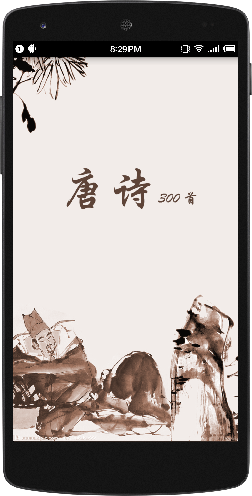
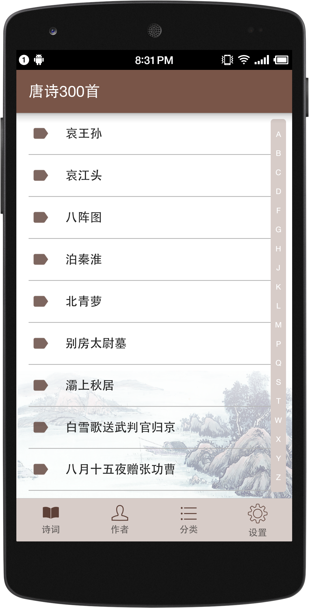
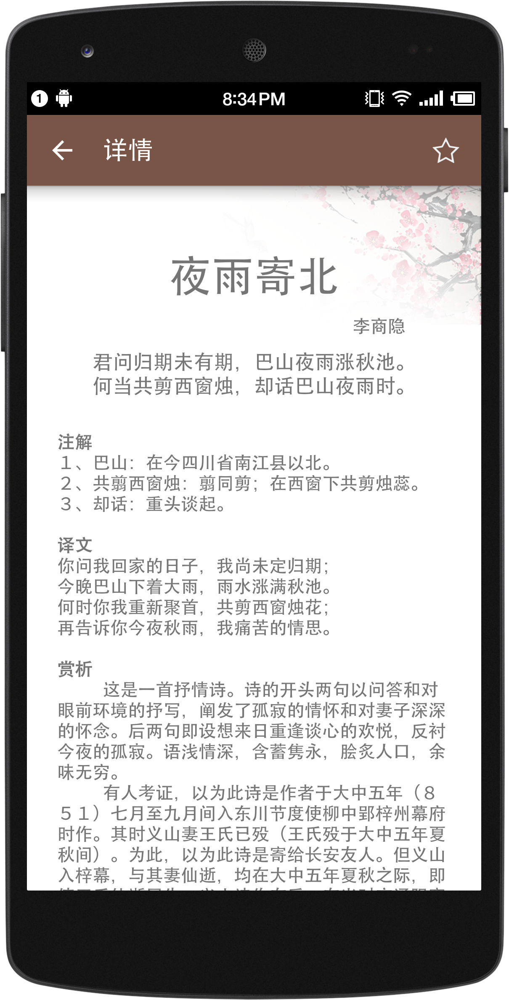
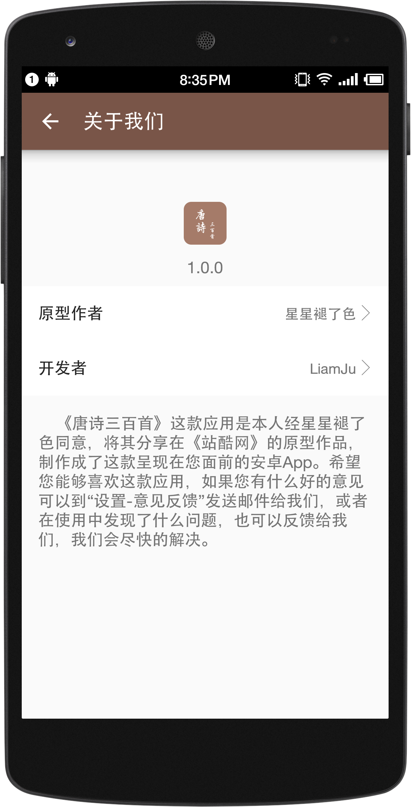

# TangShi

## 描述

这是一款经[星星褪了色](http://www.zcool.com.cn/u/13619712)作者同意，本人将他设计的[唐诗三百首](http://www.zcool.com.cn/work/ZMTM5NjY3MDA=.html)原型开发成了这款安卓应用。面向那些热爱唐诗的人群，对于本人来说主要是开发简单，同时也圆了本人独立开发应用的小梦想😂。

## 开发初衷

通过简单的应用开发，学习掌握`Android代码规范`、`简单的项目架构实现`，通过学习这些内容，编写一个属于我自己的开发文档，让自己以后写的代码更易于阅读。

## 截图

## 版本1.0

- 显示所有诗词的列表、按作者分类列表、按诗词类型分类
- 设置功能
  - 清除缓存
  - 历史记录：将读者的阅读历史记录下来
  - 我的收藏
  - 意见反馈：用户可以发送邮件，给我或者原型作者提意见或建议
  - 关于

## 版本1.1

- 根据作者、标题、诗句搜索
- 修改全局字体

## 未实现功能

1. 根据作者、标题、诗句搜索（完成）
2. 详情也可调整字体大小：大中小
3. 详情页将诗文、注释、译文、赏析的内容分离
4. 修改全局字体（完成）
5. 软件更新
6. 软件实时监控

